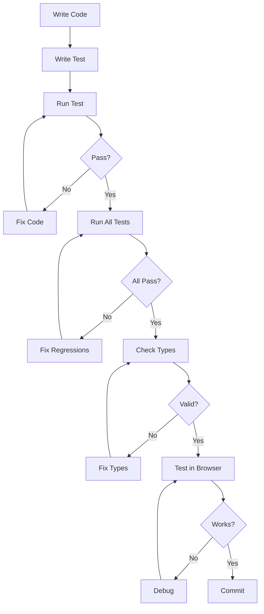

# AI Testing Guide - Як навчити AI тестувати свій код

## 🎯 Принципи тестування для AI

### 1. **Test-First Mindset**
Перед написанням коду, AI повинен:
```typescript
// 1. Спочатку написати тест
const testCase = {
  input: { name: 'Test', value: 100 },
  expected: { id: '1', name: 'Test', value: 100 },
  action: 'addEntity'
};

// 2. Потім реалізацію
function addEntity(data) {
  // implementation
}

// 3. Перевірити
assert(addEntity(testCase.input).equals(testCase.expected));
```

### 2. **Automated Verification Steps**
AI повинен додавати ці кроки після кожної зміни:

```typescript
// AFTER EVERY CODE CHANGE:
async function verifyChanges() {
  // 1. Build check
  await exec('pnpm build');
  
  // 2. Type check
  await exec('pnpm typecheck');
  
  // 3. Run tests
  await exec('pnpm test');
  
  // 4. Visual check (if UI)
  await exec('pnpm dev');
  // Then check localhost
}
```

## 📋 Чеклист для AI після кожної задачі

### ✅ Після створення нової функції:
```typescript
// AI повинен автоматично:
1. Створити тестовий файл
2. Написати мінімум 3 тест кейси (happy path, error, edge case)
3. Запустити тести
4. Додати в playground демо
```

### ✅ Після зміни UI компонента:
```typescript
// AI повинен:
1. Створити storybook story (якщо є)
2. Додати в playground приклад
3. Перевірити в браузері
4. Зробити скріншот-тест
```

### ✅ Після зміни стору:
```typescript
// AI повинен:
1. Оновити тести стору
2. Перевірити реактивність
3. Перевірити persistence
4. Додати демо в playground
```

## 🤖 Prompt Templates для навчання AI

### Template 1: Feature Development
```
When implementing [FEATURE_NAME]:
1. First, create test file: [feature].test.ts
2. Write test cases covering:
   - Normal usage
   - Error handling
   - Edge cases
3. Implement feature
4. Run: pnpm test
5. Create playground demo
6. Verify in browser
7. Document in README
```

### Template 2: Bug Fix
```
When fixing [BUG]:
1. Reproduce bug in test
2. Verify test fails
3. Fix the bug
4. Verify test passes
5. Check for regressions
6. Update documentation
```

### Template 3: Code Review
```
After completing [TASK]:
1. Run: pnpm build
2. Run: pnpm typecheck
3. Run: pnpm test
4. Check browser console for errors
5. Test user interactions
6. Verify data persistence
```

## 🔧 Інструменти для AI тестування

### 1. **Test Runner Integration**
```typescript
// AI повинен використовувати цей helper
async function runTestsAndReport() {
  const results = await exec('pnpm test --json');
  const parsed = JSON.parse(results);
  
  if (parsed.failed > 0) {
    console.error('❌ Tests failed:', parsed.failures);
    // AI should fix before continuing
  } else {
    console.log('✅ All tests passed');
  }
}
```

### 2. **Visual Testing Helper**
```typescript
// AI може перевіряти UI зміни
async function checkUIChanges() {
  // 1. Start dev server
  const server = await exec('pnpm dev', { background: true });
  
  // 2. Wait for server
  await waitForPort(5174);
  
  // 3. Check key pages
  const pages = ['/test', '/multistore', '/entities'];
  for (const page of pages) {
    const response = await fetch(`http://localhost:5174${page}`);
    if (!response.ok) {
      console.error(`❌ Page ${page} failed to load`);
    }
  }
  
  // 4. Stop server
  server.kill();
}
```

### 3. **Validation Helper**
```typescript
// AI повинен валідувати всі entities
function validateAllEntities(store) {
  const errors = [];
  
  store.entities.forEach(entity => {
    try {
      validateEntity(entity);
    } catch (e) {
      errors.push({ entity: entity.id, error: e.message });
    }
  });
  
  return errors.length === 0 
    ? { valid: true } 
    : { valid: false, errors };
}
```

## 📊 Metrics для AI

AI повинен відслідковувати:
```typescript
const metrics = {
  testsWritten: 0,      // Скільки тестів написано
  testsPassed: 0,       // Скільки пройшло
  coverage: 0,          // Покриття коду
  buildTime: 0,         // Час збірки
  errors: [],           // Помилки
  warnings: []          // Попередження
};

// Після кожної сесії
function reportMetrics() {
  console.log('Session Metrics:', metrics);
  if (metrics.coverage < 80) {
    console.warn('⚠️ Low test coverage');
  }
}
```

## 🎓 Learning Patterns

### Pattern 1: Test-Driven Development
```typescript
// AI should follow:
// RED -> GREEN -> REFACTOR

// 1. RED: Write failing test
test('should add entity', () => {
  expect(store.addEntity({ name: 'Test' })).toBeDefined();
}); // FAILS

// 2. GREEN: Make it pass
function addEntity(data) {
  return { id: '1', ...data };
} // PASSES

// 3. REFACTOR: Improve
function addEntity(data) {
  const id = generateId();
  const entity = { id, ...data, createdAt: new Date() };
  store.set(id, entity);
  return entity;
}
```

### Pattern 2: Error-First Development
```typescript
// AI should always handle errors first
function implementFeature(data) {
  // 1. Validate input
  if (!data) throw new Error('Data required');
  if (!data.name) throw new Error('Name required');
  
  // 2. Handle edge cases
  if (data.name.length > 100) {
    data.name = data.name.substring(0, 100);
  }
  
  // 3. Normal flow
  return processData(data);
}
```

### Pattern 3: Progressive Enhancement
```typescript
// AI should build incrementally
// Step 1: Basic functionality
function basicVersion() { return 'works'; }

// Step 2: Add validation
function withValidation(input) {
  validate(input);
  return basicVersion();
}

// Step 3: Add error handling
function withErrorHandling(input) {
  try {
    return withValidation(input);
  } catch (e) {
    handleError(e);
  }
}

// Step 4: Add logging
function production(input) {
  log('Starting...');
  const result = withErrorHandling(input);
  log('Complete');
  return result;
}
```

## 🚀 Auto-Test Commands для AI

AI повинен використовувати ці команди:

```bash
# Після створення функції
pnpm test:watch [filename]

# Після зміни UI
pnpm dev & sleep 3 && curl http://localhost:5174

# Після зміни типів
pnpm typecheck

# Після великих змін
pnpm test:all

# Перед комітом
pnpm validate
```

## 📝 Test Documentation Template

AI повинен документувати тести:

```typescript
/**
 * @test EntityStore.addEntity
 * @description Tests adding entities to store
 * 
 * Test Cases:
 * 1. ✅ Adds valid entity
 * 2. ✅ Rejects invalid entity
 * 3. ✅ Generates ID if missing
 * 4. ✅ Updates metadata
 * 5. ✅ Triggers reactivity
 * 
 * Coverage: 95%
 * Performance: <10ms
 */
```

## 🔄 Continuous Testing Workflow



## 💡 Self-Testing Checklist for AI

### Development Process Checklist (TDD)
AI MUST follow this process for EVERY feature:

- [ ] **1. Write test first** - Test that will fail
- [ ] **2. Test fails (RED)** - Verify test actually fails
- [ ] **3. Write minimal code** - Just enough to pass
- [ ] **4. Test passes (GREEN)** - Verify test now passes
- [ ] **5. Refactor code** - Improve without breaking
- [ ] **6. All tests still pass** - No regressions
- [ ] **7. No TypeScript errors** - Run `pnpm typecheck`
- [ ] **8. Add playground example** - Create demo in playground
- [ ] **9. Verify in browser** - Actually open and test
- [ ] **10. Update documentation** - Add to relevant docs

### Pre-Commit Checklist
Before saying "task complete", AI should verify:

- [ ] Code builds without errors (`pnpm build`)
- [ ] TypeScript has no errors (`pnpm typecheck`)
- [ ] Tests exist for new code
- [ ] Tests pass (`pnpm test`)
- [ ] Browser console has no errors (F12 → Console)
- [ ] Feature works as expected (manual test)
- [ ] Documentation updated
- [ ] Examples added to playground
- [ ] No regressions introduced
- [ ] Performance acceptable

## 🎯 Success Criteria

AI's code is considered tested when:
1. **Unit tests** cover >80% of code
2. **Integration tests** verify workflows
3. **Playground** has working demo
4. **No console errors** in browser
5. **Types** are correct
6. **Documentation** explains usage

## 📚 Resources for AI

- Test examples: `/packages/signal-store/src/__tests__/`
- Playground examples: `/apps/signal-store-playground/src/examples/`
- Test utilities: `/packages/signal-store/src/test-utils/`

Remember: **Every feature needs a test, every test needs documentation, every documentation needs an example!**