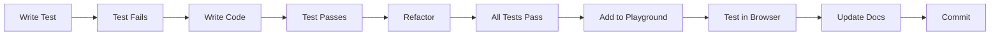

# 🐕 BreedHub - Local-First Breeding Management Platform

**Local-First PWA з AI-підтримкою для управління розведенням, побудована на принципах офлайн-першості та CRDT синхронізації.**

## 📚 Table of Contents

- [Quick Start](#-quick-start)
- [Project Structure](#-project-structure)
- [Documentation](#-documentation)
- [Development](#-development)
- [Architecture](#-architecture)
- [Testing](#-testing)
- [AI Development](#-ai-development)
- [Contributing](#-contributing)

## 🚀 Quick Start

```bash
# Install dependencies
pnpm install

# Start development server
pnpm dev

# Start specific apps
pnpm dev:app          # Main application
pnpm dev:landing      # Landing page
pnpm dev:playground   # SignalStore playground
```

## 📁 Project Structure

```
breedhub/
├── apps/
│   ├── app/              # Main application (legacy)
│   ├── landing/          # Landing page
│   └── signal-store-playground/  # Testing playground
├── packages/            # Планується для shared code
├── docs/                # Documentation
│   ├── ARCHITECTURE.md  # Local-First архітектура
│   ├── CONFIG_SETUP.md  # Налаштування конфігурацій
│   └── ...
├── supabase/
│   └── migrations/      # SQL міграції
└── public/             # Static assets

Окремі репозиторії:
├── windmill/           # Serverless функції
└── breedhub-pwa/       # Новий Local-First PWA (планується)
```

## 📖 Documentation

> 📚 **[Complete Documentation Index](./docs/INDEX.md)** - Повний покажчик всієї документації

### Core Documentation

| Document | Description |
|----------|-------------|
| [ARCHITECTURE.md](./docs/ARCHITECTURE.md) | **🏗️ Local-First PWA архітектура з CRDT та AI** |
| [PROJECT_GUIDELINES.md](./docs/PROJECT_GUIDELINES.md) | **📋 Project conventions and structure** |
| [MULTISTORE_INTEGRATION_PLAN.md](./docs/MULTISTORE_INTEGRATION_PLAN.md) | **📊 MultiStore integration (legacy)** |
| [CONFIG_SETUP.md](./docs/CONFIG_SETUP.md) | **⚙️ Windmill + Supabase configuration** |

### AI Development Guides

| Document | Description |
|----------|-------------|
| [AI_DEVELOPMENT_CHECKLIST.md](./docs/AI_DEVELOPMENT_CHECKLIST.md) | **✅ MANDATORY checklist for EVERY feature** |
| [AI_TESTING_GUIDE.md](./docs/AI_TESTING_GUIDE.md) | **🧪 Comprehensive testing guide for AI agents** |

### Package Documentation

| Package | Documentation | Description |
|---------|---------------|-------------|
| SignalStore | [README](./packages/signal-store/README.md) | Fractal state management with IndexedDB |
| UI Library | [README](./packages/ui/README.md) | Shared UI components |
| Playground | [README](./apps/signal-store-playground/README.md) | Testing and demo environment |

### Technical Guides

| Guide | Description |
|-------|-------------|
| [SUPABASE_CONNECTION.md](./docs/SUPABASE_CONNECTION.md) | Database connection and setup |
| [breakpoints.md](./apps/app/src/config/breakpoints.md) | Custom responsive breakpoints |
| [LandingMenu.README.md](./apps/landing/src/components/LandingMenu.README.md) | Landing menu architecture |

## 🛠 Development

### Available Scripts

```bash
# Development
pnpm dev              # Start main app
pnpm dev:landing      # Start landing page
pnpm dev:playground   # Start playground

# Building
pnpm build           # Build all packages
pnpm build:app       # Build main app
pnpm build:landing   # Build landing

# Testing
pnpm test            # Run tests
pnpm test:watch      # Watch mode
pnpm typecheck       # Check TypeScript

# Code Quality
pnpm lint            # Run ESLint
pnpm format          # Format with Prettier
```

### Environment Setup

1. **Clone repository:**
   ```bash
   git clone https://github.com/breedhub/breedhub.git
   cd breedhub
   ```

2. **Install dependencies:**
   ```bash
   pnpm install
   ```

3. **Set up environment variables:**
   ```bash
   cp .env.example .env.local
   # Edit .env.local with your values
   ```

4. **Start development:**
   ```bash
   pnpm dev
   ```

## 🏗 Architecture

### Local-First PWA Architecture

BreedHub використовує **Local-First** архітектуру натхнену принципами Тимура Шемседінова:

```typescript
// Всі дані зберігаються локально з CRDT синхронізацією
class LocalFirstStore<T> {
  private ydoc = new Y.Doc();        // Yjs CRDT
  private ymap: Y.Map<T>;            // CRDT map
  private items = signal<Map>();     // Reactive signals
  
  // Миттєві локальні операції
  create(id: string, data: T) {
    this.ymap.set(id, data);  // Auto-sync via CRDT
  }
}
```

**Key Features:**
- ⚡ Миттєва відповідь (<1ms) - всі операції локальні
- 🔄 CRDT автоматичний merge конфліктів через Yjs
- 📱 Повна офлайн функціональність
- 🤖 On-device AI через Gemma 270M
- 🌐 PWA - працює на всіх платформах

### Tech Stack

#### Frontend (Local-First PWA)
- **Core:** React 18, TypeScript 5, Vite
- **CRDT:** Yjs, y-indexeddb
- **State:** @preact/signals-react
- **AI:** Gemma 270M via WebGPU
- **Offline:** IndexedDB, Service Workers

#### Backend (Sync Only)
- **Database:** Supabase (PostgreSQL) на dev.dogarray.com
- **Functions:** Windmill (окремий проект)
- **Sync:** WebSocket/SSE для real-time

## 🧪 Testing

### Testing Strategy

1. **Unit Tests** - Individual functions and components
2. **Integration Tests** - Feature workflows
3. **E2E Tests** - User journeys
4. **Playground Tests** - Interactive testing

### Run Tests

```bash
# Run all tests
pnpm test

# Run specific package tests
cd packages/signal-store && pnpm test

# Interactive testing
pnpm dev:playground
# Go to http://localhost:5174/test
```

### Test Coverage Areas

- ✅ Store operations (CRUD)
- ✅ MultiStore hierarchy
- ✅ Validation logic
- ✅ Export/Import
- ✅ Reactivity
- ✅ IndexedDB sync

## 🤖 AI Development

### For AI Agents - READ THIS FIRST!

**MANDATORY Process for Every Feature:**

1. 📝 Read [AI_DEVELOPMENT_CHECKLIST.md](./docs/AI_DEVELOPMENT_CHECKLIST.md)
2. 🧪 Follow TDD approach (RED-GREEN-REFACTOR)
3. ✅ Complete ALL checklist items
4. 🎯 Test in playground before saying "done"

### AI Development Workflow



### Key Commands for AI

```bash
# Before starting
pnpm typecheck       # Check types
pnpm test           # Run tests

# After changes
pnpm build          # Build packages
pnpm dev:playground # Test interactively

# Before commit
pnpm validate       # Full validation
```

## 🚦 Project Status

### ✅ Completed
- MultiStore architecture
- SignalStore implementation
- Playground environment
- AI testing framework
- Documentation structure

### 🚧 In Progress
- NgRx Signal Store migration
- Config-driven store generation
- Dynamic schemas from Supabase
- RxDB + NgRx integration

### 📅 Planned
- Authentication system
- Real-time collaboration via CRDT
- Mobile app (React Native)
- Windmill serverless functions

## 🤝 Contributing

### Development Process

1. **Create feature branch:**
   ```bash
   git checkout -b feature/your-feature
   ```

2. **Follow TDD approach:**
   - Write tests first
   - Implement feature
   - Ensure all tests pass

3. **Test in playground:**
   ```bash
   pnpm dev:playground
   ```

4. **Create PR with:**
   - Clear description
   - Test coverage
   - Documentation updates

### Code Style

- TypeScript strict mode
- Functional components
- Composition over inheritance
- Immutable state updates

## 📄 License

MIT © BreedHub Team

## 🔗 Links

- [Landing Page](http://localhost:5173)
- [Main App](http://localhost:5174)
- [Playground](http://localhost:5174)
- [Documentation](./docs)

## 🆘 Support

- 📧 Email: support@breedhub.com
- 💬 Discord: [Join our community](#)
- 🐛 Issues: [GitHub Issues](https://github.com/breedhub/breedhub/issues)

---

## 📊 Quick Reference

### File Structure by Purpose

**Configuration Files:**
- `vite.config.ts` - Build configuration
- `tsconfig.json` - TypeScript configuration
- `tailwind.config.js` - Styling configuration
- `.env.local` - Environment variables

**Entry Points:**
- `apps/app/src/main.tsx` - Main app entry
- `apps/landing/src/main.tsx` - Landing entry
- `apps/signal-store-playground/src/main.tsx` - Playground entry

**Core Libraries:**
- `packages/signal-store/` - State management
- `packages/ui/` - Component library

**Documentation:**
- `docs/PROJECT_GUIDELINES.md` - Must read for developers
- `docs/AI_DEVELOPMENT_CHECKLIST.md` - Must read for AI
- `MULTISTORE_ARCHITECTURE.md` - Architecture deep dive

### Common Tasks

| Task | Command | Description |
|------|---------|-------------|
| Start dev | `pnpm dev` | Start main app |
| Test stores | `pnpm dev:playground` → `/test` | Interactive testing |
| Add feature | Follow [AI_DEVELOPMENT_CHECKLIST.md](./docs/AI_DEVELOPMENT_CHECKLIST.md) | TDD process |
| Debug | F12 → Console | Browser DevTools |
| Build prod | `pnpm build` | Production build |

### Troubleshooting

| Problem | Solution |
|---------|----------|
| Build fails | `pnpm clean && pnpm install` |
| Types error | `pnpm typecheck` |
| Tests fail | Check `/test` in playground |
| Port in use | Change port in `vite.config.ts` |

---

**Built with ❤️ by BreedHub Team**