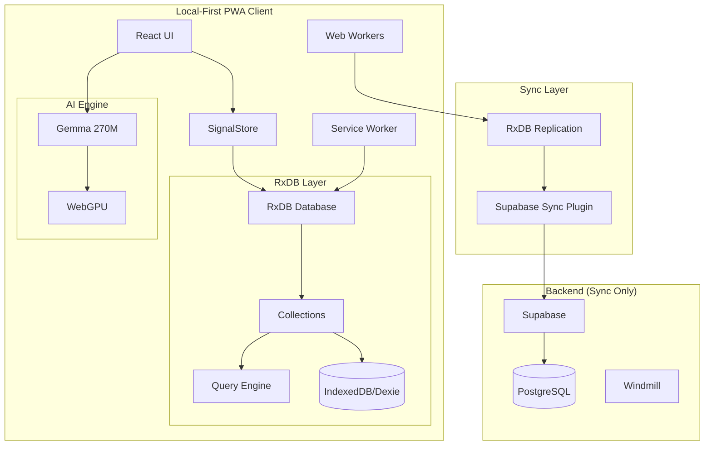

# Архітектура BreedHub 3.0

## Огляд

BreedHub 3.0 - це Local-First PWA архітектура з AI-підтримкою через Gemma 270M, натхнена принципами Тимура Шемседінова. Всі дані та обчислення знаходяться на пристрої користувача, сервер використовується лише для синхронізації. Система використовує **RxDB** - reactive офлайн-first базу даних з вбудованою синхронізацією з Supabase/PostgreSQL, автоматичним conflict resolution та потужним query engine. Архітектура забезпечує повну офлайн функціональність з реактивними оновленнями через RxJS та @preact/signals.

## Ключові принципи

### 1. Local-First Computing (за Шемседіновим)
- **RxDB + IndexedDB** як повноцінна локальна реактивна база даних
- **Автоматичний conflict resolution** через configurable strategies
- **Миттєва відповідь** - всі операції локальні (<1ms)
- **Повна автономність** - працює без інтернету необмежено
- **Eventual consistency** - синхронізація коли з'явиться зв'язок

### 2. Offline-First Data Layer з RxDB
- **RxDB Collections** - типізовані колекції з schema validation
- **Reactive Queries** - автоматичні оновлення UI через RxJS
- **SignalStore** інтегрований з RxDB для реактивності
- **Вбудована Supabase синхронізація** - автоматичний push/pull
- **Web Workers** для фонової синхронізації без блокування UI

### 3. Event-Driven для критичних операцій
- **Event Sourcing** для breeding та health операцій
- **Повна історія змін** з можливістю відтворення
- **CQRS** для оптимізованих read models
- **Часові запити** на будь-яку дату

### 4. AI-Powered Features (Gemma 270M)
- **WebGPU acceleration** - 15-40 tokens/s на різних девайсах
- **540MB модель** - швидке завантаження, кешується в браузері
- **Natural Language Interface** для введення даних
- **Intelligent Breeding Recommendations** на основі генетики
- **Automated Pedigree Analysis** та duplicate detection
- **Працює офлайн** після першого завантаження

## Технологічний стек

### Frontend (Local-First PWA)
- **Vite + React 18.3+** з TypeScript 5.0+
- **RxDB** - реактивна офлайн-first база даних
- **RxJS** для reactive programming
- **@preact/signals-react** для UI реактивності
- **Dexie.js** як storage backend для RxDB
- **@mediapipe/tasks-genai** для Gemma 270M
- **Vite PWA Plugin** для service workers
- **Web Workers** для фонової синхронізації

### Backend інфраструктура
- **Supabase** на dev.dogarray.com через Coolify (окремо від репозиторію)
- **Windmill** окремий проект для serverless функцій
- **PostgreSQL** з dynamic schemas (порт 5432)
- **pgvector** для semantic search та embeddings (планується)
- **HTTP extension** для виклику Windmill з Supabase
- **Gemma 270M** в Windmill для batch processing (планується)

### AI & Development
- **Gemma 270M** (540MB) - оптимальний розмір для браузера
- **WebGPU** першочергово, fallback на WASM
- **IndexedDB** для кешування моделі
- **GitHub Copilot** для автономної розробки
- **CLAUDE.md** правила для AI асистентів

## Архітектурна діаграма



## Реальна структура проектів

### BreedHub Local-First PWA Structure
```
breedhub-pwa/
├── public/
│   ├── manifest.json          # PWA manifest
│   ├── sw.js                  # Service Worker
│   ├── workers/
│   │   └── sync.worker.js    # Background sync
│   └── models/
│       └── gemma-270m.bin     # AI модель (540MB)
├── src/
│   ├── local-first/
│   │   ├── LocalFirstStore.ts # CRDT store wrapper
│   │   ├── SignalStore.ts     # Reactive signals
│   │   ├── SyncEngine.ts      # Sync orchestration
│   │   └── ConflictResolver.ts # Merge strategies
│   ├── ai/
│   │   ├── GemmaService.ts    # WebGPU AI engine
│   │   └── workers/
│   │       └── ai.worker.ts   # AI in Web Worker
│   ├── stores/
│   │   ├── breeds.store.ts    # LocalFirstStore<Breed>
│   │   ├── dogs.store.ts      # LocalFirstStore<Dog>
│   │   └── sync.store.ts      # Sync status signals
│   ├── components/
│   │   ├── ui/                # Base components
│   │   ├── breeds/            # Domain components
│   │   └── sync/              # Sync UI indicators
│   ├── hooks/
│   │   ├── useLocalFirst.ts   # Main data hook
│   │   ├── useSync.ts         # Sync status hook
│   │   └── useAI.ts           # AI features hook
│   └── App.tsx
├── vite.config.ts
└── package.json

### Windmill Repository (`/projects/windmill/`)
├── f/
│   ├── common/                # Існуючі утиліти
│   │   ├── config_merge.deno.ts
│   │   └── json_merge.deno.ts
│   ├── breeding/              # Існуючі breeding scripts
│   ├── measurements/          # Існуючі вимірювання
│   ├── supabase/             # Supabase інтеграції
│   └── ai/                   # ПЛАНУЄТЬСЯ: Gemma scripts
│       ├── pedigree_parser.py
│       ├── duplicate_detector.py
│       └── breeding_advisor.py
└── u/
    └── annamaliyenko/        # User resources
        └── pleasing_supabase.resource.yaml

### Зовнішні сервіси (не в репозиторіях)
- Supabase: dev.dogarray.com:8020 (API), :5432 (PostgreSQL)
- Windmill: dev.dogarray.com:8000
```

## Поетапне впровадження

### Фаза 1: Зберігаємо існуюче ✅
- MultiStore/SignalStore архітектура
- Supabase + Windmill інтеграція  
- Dynamic schemas в БД
- Hierarchical configs

### Фаза 2: RxDB Data Layer (Тижні 1-2)

#### RxDB Database Setup
```typescript
// src/database/index.ts
import { createRxDatabase, RxDatabase } from 'rxdb';
import { getRxStorageDexie } from 'rxdb/plugins/storage-dexie';
import { RxDBDevModePlugin } from 'rxdb/plugins/dev-mode';
import { signal } from '@preact/signals-react';

// Enable dev mode for debugging
if (import.meta.env.DEV) {
  addRxPlugin(RxDBDevModePlugin);
}

export async function createBreedHubDB(): Promise<RxDatabase> {
  const db = await createRxDatabase({
    name: 'breedhub',
    storage: getRxStorageDexie(),
    multiInstance: true,
    eventReduce: true,
    cleanupPolicy: {
      minimumDeletedTime: 1000 * 60 * 60 * 24 * 7, // 7 days
      minimumCollectionAge: 1000 * 60 * 60 * 24,
      runEach: 1000 * 60 * 60 * 4
    }
  });

  // Add collections with schemas
  await db.addCollections({
    breeds: {
      schema: breedSchema,
      methods: breedMethods,
      statics: breedStatics
    },
    dogs: {
      schema: dogSchema,
      methods: dogMethods
    },
    kennels: {
      schema: kennelSchema
    },
    litters: {
      schema: litterSchema
    }
  });

  return db;
}

// Integration with SignalStore
export class RxDBSignalStore<T> {
  private collection: RxCollection<T>;
  private items = signal<T[]>([]);
  private loading = signal(false);
  
  constructor(collection: RxCollection<T>) {
    this.collection = collection;
    
    // RxDB → Signals reactivity
    this.collection.$.subscribe(docs => {
      this.items.value = docs;
    });
  }
  
  // Reactive queries
  find(query: MangoQuery<T>) {
    return this.collection.find(query).$;
  }
  
  // CRUD operations - instant and offline
  async create(data: T) {
    return this.collection.insert(data);
  }
  
  async update(id: string, updates: Partial<T>) {
    const doc = await this.collection.findOne(id).exec();
    if (doc) {
      await doc.patch(updates);
    }
  }
  
  async delete(id: string) {
    const doc = await this.collection.findOne(id).exec();
    if (doc) {
      await doc.remove();
    }
  }
}
```

#### Supabase Replication Setup
```typescript
// src/database/replication.ts
import { replicateRxCollection } from 'rxdb/plugins/replication';
import { createClient } from '@supabase/supabase-js';

const supabase = createClient(
  'http://dev.dogarray.com:8020',
  process.env.VITE_SUPABASE_ANON_KEY
);

export async function setupSupabaseReplication(db: RxDatabase) {
  // Replication для кожної колекції
  const collections = ['breeds', 'dogs', 'kennels', 'litters'];
  
  for (const collectionName of collections) {
    const collection = db[collectionName];
    
    const replicationState = replicateRxCollection({
      collection,
      replicationIdentifier: `${collectionName}-supabase`,
      
      // Pull from Supabase
      pull: {
        async handler(checkpoint) {
          const query = supabase
            .from(collectionName)
            .select('*')
            .order('updated_at', { ascending: true });
            
          if (checkpoint) {
            query.gt('updated_at', checkpoint.updated_at);
          }
          
          const { data, error } = await query.limit(100);
          
          if (error) throw error;
          
          return {
            documents: data || [],
            checkpoint: data?.length ? 
              { updated_at: data[data.length - 1].updated_at } : 
              checkpoint
          };
        },
        batchSize: 100,
        modifier: (doc) => doc // Transform if needed
      },
      
      // Push to Supabase
      push: {
        async handler(docs) {
          const { error } = await supabase
            .from(collectionName)
            .upsert(docs);
            
          if (error) throw error;
          return [];
        },
        batchSize: 50,
        modifier: (doc) => doc
      }
    });
    
    // Error handling
    replicationState.error$.subscribe(err => {
      console.error(`Replication error for ${collectionName}:`, err);
    });
  }
}
```

### Фаза 3: Event Sourcing (Тижні 3-4)

#### Event Store для критичних операцій
```typescript
// packages/event-store/events/BreedingEvents.ts
interface BreedingEvent extends EntityEvent {
  type: 'DogBred' | 'LitterBorn' | 'PuppyRegistered';
  entityType: 'dog' | 'litter';
  aggregateId: string;
  timestamp: Date;
  userId: string;
  data: any;
  metadata?: {
    workspaceId: string;
    spaceId: string;
  };
}

// packages/event-store/EventedSignalStore.ts
export class EventedSignalStore extends SignalStore {
  private eventStore: EventStore;
  
  async dispatch(event: BreedingEvent) {
    // Зберігаємо подію
    await this.eventStore.append(event);
    
    // Оновлюємо стан через сигнали
    this.updateSignal(event.entityId, event.data);
    
    // Синхронізуємо через Windmill якщо онлайн
    if (this.isOnline) {
      await this.callWindmillScript('process_event', event);
    }
  }
  
  // Відтворення стану на дату
  async getStateAt(entityId: string, date: Date) {
    const events = await this.eventStore.getEventsUntil(entityId, date);
    return this.replayEvents(events);
  }
}
```

#### SQL міграція для Event Store
```sql
-- supabase/migrations/003_event_store.sql
CREATE TABLE breeding_events (
  id UUID PRIMARY KEY DEFAULT gen_random_uuid(),
  aggregate_id UUID NOT NULL,
  event_type TEXT NOT NULL,
  entity_type TEXT NOT NULL,
  event_data JSONB NOT NULL,
  metadata JSONB,
  user_id UUID NOT NULL,
  created_at TIMESTAMPTZ DEFAULT NOW(),
  
  INDEX idx_aggregate_events (aggregate_id, created_at),
  INDEX idx_event_type (event_type)
);

-- Проекції для швидких запитів
CREATE MATERIALIZED VIEW breeding_statistics AS
SELECT 
  kennel_id,
  COUNT(DISTINCT sire_id) as active_sires,
  COUNT(DISTINCT dam_id) as active_dams,
  COUNT(*) as total_breedings
FROM breeding_events
WHERE event_type = 'DogBred'
GROUP BY kennel_id;
```

### Фаза 4: Web Workers (Тижні 5-6)

#### Worker Manager
```typescript
// packages/workers/WorkerManager.ts
export class BreedHubWorkerManager {
  private workers = {
    dataProcessor: new Worker('/workers/data-processor.js'),
    syncWorker: new Worker('/workers/sync-worker.js'),
    analytics: new Worker('/workers/analytics.js')
  };
  
  // Аналіз родоводів у фоні
  async analyzePedigree(dogId: string): Promise<PedigreeAnalysis> {
    return new Promise((resolve) => {
      this.workers.analytics.postMessage({
        type: 'PEDIGREE_ANALYSIS',
        entityType: 'dog',
        id: dogId
      });
      
      this.workers.analytics.onmessage = (e) => {
        if (e.data.type === 'PEDIGREE_ANALYSIS_COMPLETE') {
          resolve(e.data.result);
        }
      };
    });
  }
  
  // Фонова синхронізація
  startBackgroundSync() {
    this.workers.syncWorker.postMessage({
      type: 'START_SYNC',
      interval: 30000 // 30 секунд
    });
  }
}
```

#### Data Processing Worker
```typescript
// packages/workers/data-processor/index.ts
self.addEventListener('message', async (event) => {
  const { type, data } = event.data;
  
  switch (type) {
    case 'PROCESS_BULK_IMPORT':
      const processed = await processBulkDogs(data);
      self.postMessage({ 
        type: 'BULK_IMPORT_COMPLETE', 
        result: processed 
      });
      break;
      
    case 'CALCULATE_INBREEDING':
      const coi = await calculateCOI(data.pedigree);
      self.postMessage({ 
        type: 'INBREEDING_CALCULATED', 
        result: coi 
      });
      break;
  }
});
```

### Фаза 5: PWA з нуля (Тижні 1-4)

#### Створення нового Local-First PWA проекту
```bash
# Створюємо новий проект з Vite
npm create vite@latest breedhub-pwa -- --template react-ts
cd breedhub-pwa

# Local-First залежності
npm install yjs y-indexeddb y-websocket
npm install @preact/signals-react
npm install dexie

# PWA та AI залежності
npm install -D vite-plugin-pwa workbox-window
npm install @mediapipe/tasks-genai

# Backend sync
npm install @supabase/supabase-js
```

#### PWA Configuration
```typescript
// vite.config.ts
import { defineConfig } from 'vite';
import { VitePWA } from 'vite-plugin-pwa';

export default defineConfig({
  plugins: [
    VitePWA({
      registerType: 'autoUpdate',
      includeAssets: ['models/*.bin'],
      manifest: {
        name: 'BreedHub AI',
        short_name: 'BreedHub',
        theme_color: '#ffffff',
        display: 'standalone',
        orientation: 'portrait'
      },
      workbox: {
        maximumFileSizeToCacheInBytes: 600 * 1024 * 1024, // 600MB для Gemma
        runtimeCaching: [{
          urlPattern: /^https:\/\/.*\/models\/.*/,
          handler: 'CacheFirst',
          options: {
            cacheName: 'ai-models-cache'
          }
        }]
      }
    })
  ]
});
```

### Фаза 6: Gemma 270M інтеграція (Тижні 5-8)

#### Browser-based Gemma з WebGPU
```typescript
// src/ai/GemmaService.ts
import { LlmInference } from '@mediapipe/tasks-genai';

export class GemmaService {
  private model: LlmInference | null = null;
  
  async initialize(onProgress?: (percent: number) => void) {
    // Check WebGPU support
    const hasWebGPU = 'gpu' in navigator;
    
    this.model = await LlmInference.createFromOptions({
      baseOptions: {
        modelAssetPath: '/models/gemma-270m.bin', // 540MB
        delegate: hasWebGPU ? 'GPU' : 'CPU'
      },
      maxTokens: 512,
      temperature: 0.7
    }, onProgress);
  }
  
  // Natural Language команди
  async parseCommand(text: string): Promise<any> {
    const prompt = `Parse breeding command: "${text}"
    Examples:
    - "запиши вагу Макса 450г" → {"action":"weight","name":"Макс","value":450}
    - "зареєструй на виставку" → {"action":"show_register"}
    Return JSON`;
    
    const response = await this.model!.generateResponse(prompt);
    return JSON.parse(response);
  }
  
  // Пошук найкращої пари
  async findBestMatch(dog: Dog, candidates: Dog[]): Promise<Match[]> {
    const prompt = `Rate breeding matches for ${dog.name}:
    ${candidates.map(c => `${c.name}: ${c.titles}, COI:${c.coi}`).join('\n')}
    Return JSON array with scores 0-100`;
    
    const response = await this.model!.generateResponse(prompt);
    return JSON.parse(response);
  }
}
```

#### Server-side Gemma в Windmill
```python
# windmill/f/ai/pedigree_parser.py
from transformers import AutoModelForCausalLM, AutoTokenizer
import json
import wmill

# Використовуємо Windmill resources для доступу до Supabase
supabase = wmill.get_resource("u/annamaliyenko/pleasing_supabase")

def parse_pedigree_batch(documents: list) -> list:
    """Парсинг архівних родоводів"""
    model = AutoModelForCausalLM.from_pretrained(
        "google/gemma-2-270m",  # Спочатку базова модель
        device_map="cpu"
    )
    
    results = []
    for doc in documents:
        prompt = f"Extract dog pedigree info: {doc}"
        parsed = model.generate(prompt)
        results.append(json.loads(parsed))
    
    # Зберігаємо результати в Supabase
    supabase.table('parsed_pedigrees').insert(results).execute()
    return results

def detect_duplicates(dogs: list) -> dict:
    """Знаходження дублікатів через текстове порівняння"""
    # Спрощена версія без pgvector спочатку
    duplicates = {}
    for i, dog1 in enumerate(dogs):
        for j, dog2 in enumerate(dogs[i+1:], i+1):
            if similarity_score(dog1, dog2) > 0.95:
                duplicates.setdefault(dog1['id'], []).append(dog2['id'])
    
    return duplicates
```

### Фаза 7: Віртуалізація для великих датасетів (Тижні 15-16)

```typescript
// components/DogList/VirtualDogGrid.tsx
import { useVirtualizer } from '@tanstack/react-virtual';

export const VirtualDogGrid = ({ dogs }: { dogs: Dog[] }) => {
  const containerRef = useRef<HTMLDivElement>(null);
  
  const rowVirtualizer = useVirtualizer({
    count: Math.ceil(dogs.length / 4),
    getScrollElement: () => containerRef.current,
    estimateSize: () => 300,
    overscan: 2
  });
  
  return (
    <div ref={containerRef} className="dog-grid h-full overflow-auto">
      <div style={{ height: `${rowVirtualizer.getTotalSize()}px` }}>
        {rowVirtualizer.getVirtualItems().map(virtualRow => (
          <div
            key={virtualRow.index}
            style={{
              position: 'absolute',
              top: 0,
              left: 0,
              width: '100%',
              height: `${virtualRow.size}px`,
              transform: `translateY(${virtualRow.start}px)`
            }}
          >
            <DogCardRow 
              dogs={dogs.slice(
                virtualRow.index * 4, 
                (virtualRow.index + 1) * 4
              )}
            />
          </div>
        ))}
      </div>
    </div>
  );
};
```

## Premium функції з Gemma AI

### Безплатна версія
- Ручне введення даних через форми
- Базові звіти та статистика
- До 10 собак
- Стандартні фільтри та пошук

### Premium версія (з Gemma)
- **Natural Language команди**: "Запиши вагу цуценят Луни: Макс 450г, Белла 420г"
- **Пошук найкращої пари**: Аналіз генетики, COI, титулів
- **Аналіз стандарту породи**: Оцінка відповідності 0-100
- **Генерація імен**: За темою посліту та літерою
- **Парсинг родоводів**: Автоматичний імпорт з документів
- **Виявлення дублікатів**: Мердж однакових записів
- **Необмежена кількість собак**

### Технічна реалізація Premium
```typescript
// apps/mobile/src/screens/AIAssistantScreen.tsx
const AIAssistant = () => {
  const { subscription } = useUser();
  
  if (!subscription.isPremium) {
    return <UpgradePrompt feature="AI Assistant" price="$9.99/month" />;
  }
  
  const gemma = useGemmaClient(); // Завантажує модель на device
  
  return (
    <VoiceInput 
      onCommand={async (text) => {
        const action = await gemma.processCommand(text);
        await executeAction(action);
      }}
    />
  );
};
```

## AI Integration правила

### CLAUDE.md оновлення
```markdown
# BreedHub Architecture Rules

## Core Principles
- Use MultiStore for all entities
- SignalStore for reactive state  
- PowerSync for offline operations
- Events ONLY for breeding/health operations
- Windmill for complex computations
- Web Workers for heavy processing

## Code Conventions
- TypeScript strict mode always
- Functional components with hooks
- Lazy loading for heavy components
- All operations must be idempotent
- Consider offline-first for all features

## Entity Structure
Every entity MUST follow:
- Has type field
- Extends BaseEntity
- Registered in MultiStore
- Has offline sync rules
- Emits events for critical changes

## Performance Requirements
- UI response < 10ms (offline)
- Sync latency < 1s (online)
- Support 10M+ records
- 60fps scrolling always
```

## Метрики успіху

| Метрика | Поточний стан | Цільовий стан | Як вимірювати |
|---------|---------------|---------------|---------------|
| Відгук UI | 100-200ms | <10ms offline | Performance.now() |
| Синхронізація | Реалтайм | CRDT auto-merge | Sync conflict rate |
| Масштабування | 10K записів | 10M+ записів | Load testing |
| Офлайн робота | Немає | 100% функцій | Feature coverage |
| Історія змін | Немає | Повна через events | Event store size |
| Продуктивність розробки | Baseline | +70% з AI | Commit frequency |

## Безпека та авторизація

### Supabase RLS політики
```sql
-- Петловери бачать лише своїх тварин
CREATE POLICY "pet_lovers_own_dogs" ON dogs
  FOR ALL USING (
    auth.uid() = owner_id AND 
    user_type = 'pet_lover'
  );

-- Брідери мають доступ до kennels
CREATE POLICY "breeders_kennel_access" ON dogs
  FOR ALL USING (
    kennel_id IN (
      SELECT kennel_id FROM breeder_kennels 
      WHERE breeder_id = auth.uid()
    )
  );

-- Event store - тільки append
CREATE POLICY "append_only_events" ON breeding_events
  FOR INSERT WITH CHECK (user_id = auth.uid());
```

## Моніторинг та обслуговування

### Ключові метрики для моніторингу
- PowerSync sync queue size
- Event store growth rate
- Worker memory usage
- Offline cache size
- Sync conflict frequency

### Maintenance tasks
- Weekly: Compact event store projections
- Monthly: Analyze sync patterns
- Quarterly: Review offline storage usage

## Особливості існуючої інфраструктури

### Виклики
1. **Розділені репозиторії**: BreedHub і Windmill окремо - потрібна синхронізація типів
2. **Локальний Supabase**: На dev.dogarray.com через Coolify - ускладнює CI/CD
3. **Ручні міграції**: SQL міграції виконуються вручну через psql
4. **Відсутність монорепо з backend**: Windmill не в основному репозиторії

### Переваги
1. **Повний контроль**: Власний сервер з Supabase
2. **Гнучкість Windmill**: Легко додавати нові скрипти
3. **Існуюча база**: Вже працюючі web додатки та API

## Реалістичний Roadmap для PWA

### Етап 1: MVP (Тижні 1-4)
- [ ] Створити новий PWA проект з Vite
- [ ] Базовий UI для breeds/dogs
- [ ] Інтеграція з Supabase
- [ ] Service Worker для офлайн
- [ ] PWA deployment на Vercel/Netlify

### Етап 2: AI Integration (Тижні 5-8)
- [ ] Інтегрувати Gemma 270M через MediaPipe
- [ ] WebGPU оптимізація
- [ ] Natural Language Interface
- [ ] Premium subscription через Stripe
- [ ] AI функції для breeding analysis

### Етап 3: Advanced Features (Тижні 9-12)
- [ ] PowerSync для складного офлайн
- [ ] Windmill інтеграція для batch processing
- [ ] Push notifications (Web Push API)
- [ ] Install prompts для mobile
- [ ] App Store/Play Store через Capacitor (опційно)

### Етап 4: Оптимізація (Місяці 4-6)
- [ ] Performance tuning для 100K+ записів
- [ ] CDN для моделей та зображень
- [ ] A/B testing для AI features
- [ ] Analytics та monitoring

## Чому Local-First PWA для BreedHub?

### Переваги Local-First архітектури (за Шемседіновим)
1. **Миттєва відповідь** - всі операції локальні (<1ms)
2. **Повна офлайн робота** - не залежить від інтернету
3. **Автоматичне вирішення конфліктів** - CRDT merge
4. **Приватність даних** - все зберігається локально
5. **Масштабованість** - сервер лише для синхронізації
6. **Resilience** - немає single point of failure

### Переваги PWA підходу
1. **Єдина кодова база** для всіх платформ
2. **Миттєві оновлення** без App Store review
3. **Gemma 270M через WebGPU** - 15-40 tokens/s
4. **Install як native app** на всіх платформах
5. **SEO та sharing** - індексація Google
6. **Нижча вартість** розробки

### PWA як Native App
- **Install prompt** на mobile/desktop
- **Offline mode** через Service Workers
- **Push notifications** (крім iOS Safari)
- **Home screen icon** та splash screen
- **Standalone mode** без browser UI
- **File system access** для import/export

### Fallback план
Якщо згодом потрібен native доступ:
```javascript
// Обгортаємо PWA в Capacitor
npm install @capacitor/core @capacitor/ios @capacitor/android
npx cap init
npx cap add ios
npx cap add android
// PWA стає native app!
```

## Посилання

- [Vite PWA Plugin](https://vite-pwa-org.netlify.app/)
- [MediaPipe LLM Inference](https://developers.google.com/mediapipe/solutions/genai/llm_inference/web_js)
- [WebLLM](https://webllm.mlc.ai/)
- [PowerSync Docs](https://docs.powersync.com)
- [Supabase Local Development](https://supabase.com/docs/guides/local-development)
- [Windmill Documentation](https://windmill.dev/docs)